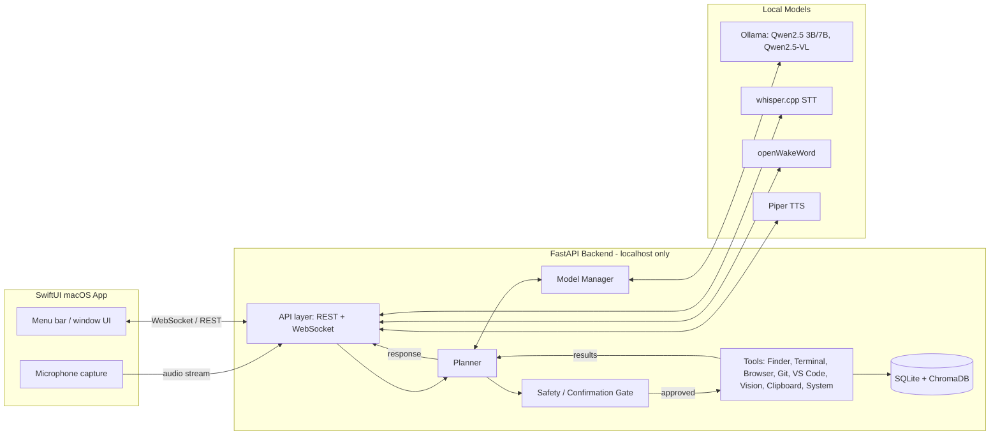

# Architecture

## 1. Design goals

1. **Local-first, 100% free.** No paid API is required for any core feature. Every
   model runs on-device via Ollama, whisper.cpp, Piper, and openWakeWord.
2. **Safe by construction.** The LLM never directly executes a command. Every action
   flows through a planner that produces a structured, typed plan, and destructive
   actions require explicit user confirmation before execution.
3. **Fits in 8GB of RAM.** The target machine is a MacBook Air M2 with 8GB unified
   memory. The architecture actively manages which ML model is resident in memory at
   any given time rather than assuming all models can run concurrently.
4. **Extensible.** New capabilities are added as self-contained "tools" that are
   auto-discovered — first-party tools and user/community plugins use the same
   mechanism.

## 2. System overview



## 3. Request flow: `User → Planner → Tool Selection → Execution → Result → LLM`

This is the core control-flow invariant of the system and is not optional for any
feature, including "simple" ones.

1. **User** speaks or types an utterance. Voice is captured by the SwiftUI app,
   streamed to the backend, wake-word-gated by openWakeWord, transcribed by
   whisper.cpp.
2. **Planner** (`backend/app/planner/`) takes the transcribed/typed utterance plus
   relevant memory context (recent commands, active project, preferences pulled from
   the vector store) and produces a **structured plan**: an ordered list of tool
   calls, each validated against a Pydantic schema (`planner/schemas.py`). The
   planner itself is LLM-assisted (the LLM proposes candidate tool calls) but the
   *output* is always a typed, validated object — never raw text that gets `exec`'d.
3. **Tool Selection**: each proposed tool call is matched against the tool registry
   (`backend/app/tools/registry.py`), which auto-discovers available tools (built-in
   and plugins) implementing the `Tool` interface (`backend/app/tools/base.py`).
4. **Safety gate** (`backend/app/core/safety.py`): before execution, each tool call is
   checked against a destructiveness policy. Tools self-report a risk level
   (`safe`, `sensitive`, `destructive`). `destructive` and `sensitive` calls (delete
   file, `rm -rf`, uninstall package, format disk, send data externally) block on an
   explicit user confirmation round-trip through the UI before proceeding.
5. **Execution**: the tool runs (subprocess, AppleScript, Playwright page action,
   filesystem op, etc.) and returns a structured `ToolResult`.
6. **Result** flows back to the Planner, which may chain further tool calls (e.g.,
   "open project and run tests" = open tool call, then terminal tool call) or decide
   the plan is complete.
7. **LLM** is invoked last, over the collected `ToolResult`s, purely to compose the
   natural-language response spoken back to the user via Piper TTS. The LLM does not
   see or need raw system access at this stage — it only summarizes structured data
   it's handed.

This separation means: if the LLM hallucinates or is prompt-injected (e.g., via text
on a webpage during browser automation), it can at most *propose* a tool call — it
cannot bypass the schema validation or the safety gate to execute something it
proposed unilaterally.

## 4. The Model Manager: fitting ML workloads into 8GB

Approximate resident RAM footprint of each component:

| Component | Approx. RAM | Always resident? |
|---|---|---|
| macOS + system processes | ~2.5-3 GB | yes |
| Backend + SwiftUI app | ~200-400 MB | yes |
| whisper.cpp (`base.en`/`small.en`, Metal) | ~0.5-1 GB | yes, while voice is active |
| Piper TTS | ~100-150 MB | yes, while voice is active |
| openWakeWord | ~50-100 MB | yes, while listening |
| Qwen2.5 3B Instruct (Q4_K_M) | ~2 GB | on-demand (default LLM) |
| Qwen2.5 7B Instruct (Q4_K_M) | ~4.5-5 GB | on-demand, "power mode" only |
| Qwen2.5-VL (vision) | ~3-4 GB | on-demand, mutually exclusive with the text LLM |
| Playwright/Chromium | ~300-500 MB | only during browser automation |

With ~5GB of realistic headroom, running the 3B LLM alongside STT/TTS/wake-word is
comfortable. Running the 7B LLM or the vision model *at the same time* as anything
else heavy is not. `backend/app/core/model_manager.py` therefore owns a small state
machine:

```
IDLE ──requestLLM()──> LLM_LOADED ──requestVision()──> (unload LLM) ──> VISION_LOADED
  ^                         │                                              │
  └─────────unload──────────┘←─────────────────unload───────────────────--┘
```

Rules:
- Only one of {text LLM, vision model} may be loaded at a time. Requesting one unloads
  the other first (via Ollama's model unload/keep-alive controls).
- STT, TTS, and wake-word are small enough to stay resident continuously and are not
  managed by this state machine.
- The default LLM is Qwen2.5 3B. A user-facing "power mode" toggle allows switching to
  7B, with a warning that vision and heavy multitasking may degrade performance while
  it's loaded.
- Vision is *never* loaded proactively — only on an explicit user request ("look at my
  screen"), per the product spec, which conveniently aligns with the RAM budget.

## 5. Safety / confirmation gate

Every `Tool` implementation declares a `risk_level` per action:

- `safe` — read-only or clearly reversible (list files, take screenshot, open app).
- `sensitive` — reversible but consequential (close app, move file, run arbitrary
  terminal command that isn't obviously destructive).
- `destructive` — hard or impossible to reverse (delete file/folder, `rm -rf`,
  format disk, uninstall a package, overwrite git history).

`destructive` calls always block on confirmation. `sensitive` calls are configurable
(default: confirm on first use per session, then remembered per exact command unless
the user opts into always-confirm). The confirmation round-trip is a WebSocket message
to the SwiftUI app requesting approval, with the exact command/action shown verbatim —
never a paraphrase — so the user approves what will actually run.

## 6. Plugin system

`backend/app/tools/base.py` defines the `Tool` abstract interface (name, description,
JSON-schema for arguments, `risk_level`, async `execute()`). `backend/app/tools/
registry.py` discovers tools two ways:

1. **Built-in tools**: every submodule under `backend/app/tools/` that exposes a
   `Tool` subclass is registered at startup.
2. **User plugins**: `backend/app/plugins/` is scanned for additional Python packages
   at startup (and optionally hot-reloaded). A plugin is just a Python package
   exposing one or more `Tool` subclasses — same interface, no special-casing. This
   means first-party and community tools are architecturally identical, which keeps
   the core simple and makes the project genuinely extensible as an open-source
   project.

## 7. Memory

- **SQLite** (`backend/app/memory/store.py`): structured history — commands run,
  projects/folders used, user preferences, confirmation decisions.
- **ChromaDB** (`backend/app/memory/vector_store.py`): embeddings of conversation
  turns, project context, and command history for semantic recall ("open the project
  I was working on yesterday about X"). Embeddings produced locally via
  `nomic-embed-text` (Ollama) or `all-MiniLM-L6-v2` (CPU fallback).
- The planner queries both stores for context before building a plan, and writes back
  after execution (what was done, and whether the user confirmed or rejected it) —
  this is what lets the assistant get better at anticipating confirmations over time.

## 8. Communication: SwiftUI ↔ Backend

The FastAPI backend binds only to `127.0.0.1` on a port chosen at launch, with a
per-session token the SwiftUI app receives when it spawns/attaches to the backend
process. REST is used for simple request/response (tool listing, history queries);
WebSocket is used for anything streaming (live transcription, streaming LLM tokens,
confirmation prompts, TTS audio chunks). No component of this system is ever exposed
beyond localhost.

## 9. Folder structure

See the root [README.md](../README.md) for the roadmap and `backend/README.md` for the
backend package layout in detail. In summary:

```
backend/app/
├── api/        # FastAPI routers (chat, voice, tools, memory, health)
├── core/       # config, logging, model_manager, safety
├── planner/    # utterance -> structured plan
├── tools/      # one subpackage per tool (finder, terminal, browser, git, vscode, vision, clipboard, system)
├── memory/     # SQLite + ChromaDB
├── speech/     # STT + wake word
├── tts/        # Piper wrapper
├── vision/     # Qwen2.5-VL wrapper
└── plugins/    # user/community tool packages, auto-discovered
```

## 10. Phase roadmap

See the root README for the 10-phase roadmap. Each phase is implemented and reviewed
completely before the next begins; this document is updated as decisions evolve.
